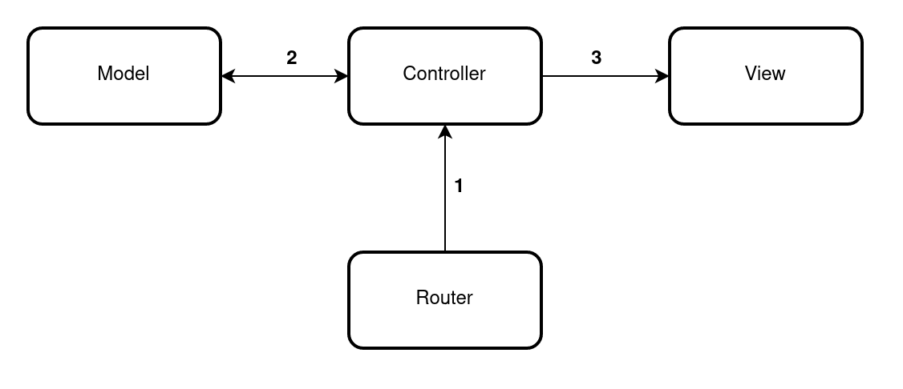
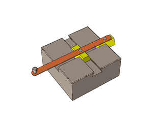
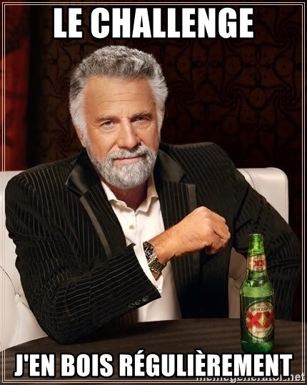

# Mon premier MVC de poche

## C'est quoi un MVC ?
Le MVC est une façon d'organiser votre code en trois parties séparées :
- les **M**odèles : servent d'interprètes avec les bases de données.
- les **V**ues : affichent les pages web.
- les **C**ontrôleurs : sont les chefs d'orchestres.

J'ajoute également une porte d'entrée que l'on appelle Routeur :

- Tout commence là. **Le routeur** (router) intercepte toutes les demandes du navigateur. C'est le routeur qui appelle le premier contrôleur [flèche 1 sur le schéma].
- **Le contrôleur** c'est un peu le chef d'orchestre de l'organisation MVC :
  - Il traite les entrées utilisateurs (*Par exemple, des données transmises par une requête POST*)
  - Il va traiter des opérations liées à la base de données via **les modèles** [flèche 2 sur le schéma]
  - Il va afficher ce qu'il souhaite via **les vues** [flèche 3 sur le schéma]

## Je fabrique mon premier MVC (de poche)
Jetez un œil au petit MVC contenu dans le répertoire `exo` :

Le routeur est déjà créé, c'est le petit fichier `index.php`. Il contient des instructions pour appeler deux contrôleurs.
  - Un contrôleur qui se lance lorsque le visiteur appelle `index.php?hello`
  - Un contrôleur par défaut, qui se lance pour toutes les autres demandes. Par exemple il se lance même lorsque le visiteur appelle `index.php?miaow` ou `index.php?usa`

### But de l'exo

Votre mission, si vous l'acceptez, est d'observer le comportement du contrôleur par défaut et de vous en inspirer pour développer le contrôleur hello.

Ce contrôleur hello (`ctrl.hello.php` pour les intimes) doit choper une info (autre que la date du jour) dans le `model.hello.php` et l'afficher dans le navigateur grâce au `view.hello.php`

À vos marques ? Prêts ? Codez !

### Pour aller plus loin

Quoi, vous avez déjà terminé cet exo. Ok voici du challenge alors.

On va s'ajouter une nouvelle route appelée `citoyen-read-all`.

Du coup, on créé les nouveaux fichiers suivants :
- `controller/ctrl.citoyen-read-all.php`
- `model/model.citoyen.php`
- `view/view.citoyen-read-all.php`

Votre mission : afficher tous les "citoyens" d'une base de données, lorsqu'un visiteur appelle `index.php?citoyen-read-all`.